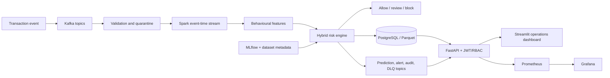

# SentinelStream

> An explainable, event-driven fraud-risk platform built for reproducible experimentation and realistic operations.


SentinelStream takes a transaction from typed ingestion to event-time features,
hybrid risk scoring, an explainable decision, persistence, alerting, analyst
feedback, and operational monitoring. It is designed as a serious technical
portfolio project: reproducible, inspectable, security-aware, and honest about
the boundary between a local demonstration and a production payments system.

## Why this project stands out

- **Streaming-first:** Kafka contracts, validation, retries, idempotency, replay,
  dead letters, offsets, Spark watermarks, deduplication, and stateful features.
- **Decision-ready ML:** supervised, anomaly, rule, and profile signals combine
  into calibrated allow/review/block outcomes with reason codes and explanations.
- **Operationally complete:** FastAPI, JWT/RBAC, PostgreSQL, Redis, Streamlit,
  Prometheus, Grafana, MLflow, migrations, health endpoints, and Docker Compose.
- **Reproducible by design:** deterministic synthetic data, dataset manifests,
  research runners, benchmarks, model metadata, and documented limitations.
- **Security-conscious:** secret-backed configuration, PII masking, redacted
  logs, bounded requests, parameterized queries, non-root containers, and CI scans.

## Architecture



The detailed boundaries, contracts, trust model, and known deployment limits
are documented in [`docs/architecture.md`](docs/architecture.md).

## Technology

Python 3.12–3.14 · uv · Pydantic · pandas · scikit-learn · Confluent Kafka ·
Spark Structured Streaming · SQLAlchemy · Alembic · PostgreSQL · Redis ·
FastAPI · Streamlit · MLflow · Optuna · Prometheus · Grafana · pytest · Ruff ·
mypy · Docker Compose · GitHub Actions.

## Quick start

### Requirements

- Python 3.12–3.14
- [uv](https://docs.astral.sh/uv/)
- Docker Desktop with Compose v2 for the full platform
- Approximately 8 GB of memory for the Kafka/Spark demonstration profile

### Install

```bash
cp .env.example .env
uv python install 3.12
uv venv --python 3.12
make install
```

### Run the offline demo

This path needs no Kafka, Spark, database, or Docker services:

```bash
uv run python scripts/run_demo.py --count 100
```

It generates deterministic transactions, validates them, runs the research
path, and writes a summary plus research tables under `reports/demo/`.

### Run the full local platform

```bash
docker compose up --build
```

Use `-d` to run in the background and inspect service health with:

```bash
docker compose ps
docker compose logs -f api spark-streaming
```

Once healthy, the main interfaces are:

| Service | URL |
| --- | --- |
| Streamlit dashboard | <http://127.0.0.1:8501> |
| FastAPI / OpenAPI | <http://127.0.0.1:8000/docs> |
| Kafka UI | <http://127.0.0.1:8080> |
| MLflow | <http://127.0.0.1:5000> |
| Prometheus | <http://127.0.0.1:9090> |
| Grafana | <http://127.0.0.1:3000> |
| Spark master UI | <http://127.0.0.1:8081> |

Migrations run from the API entrypoint and Kafka topics are created by
`kafka-init`. Change development credentials in `.env` before exposing any
interface outside your local machine.

## End-to-end demonstration

After the Compose stack is healthy:

```bash
make generate-sample
uv run python scripts/train_model.py --input data/samples/transactions.jsonl
uv run python scripts/publish_sample_transactions.py --count 20 --seed 42
```

Inspect validated transactions, predictions, alerts, audit events, and
dead-letter records in Kafka UI. The full walkthrough is in
[`docs/demo.md`](docs/demo.md).

## Research and benchmarks

Run a labelled research experiment:

```bash
make generate-sample
uv run python scripts/run_research.py \
  --input data/samples/transactions.parquet \
  --experiment-id local-comparison
```

Run the bounded inference benchmark:

```bash
uv run python scripts/benchmark.py --suite inference --iterations 100 --warmup 10
```

The repository does not claim benchmark or model-quality numbers that have not
been produced by the corresponding command. See [`docs/research.md`](docs/research.md)
and [`docs/benchmarks.md`](docs/benchmarks.md) for methodology.

## Quality gates

```bash
make lint
make format
make typecheck
make test
make docs-validate
make security
```

GitHub Actions also validate Python quality, tests, Docker builds, dependency
and secret scanning, CodeQL, documentation, and release images.

## Repository map

```text
src/sentinelstream/   application packages and typed public interfaces
tests/                 unit, integration, API, security, monitoring, and performance tests
scripts/               generation, training, research, benchmark, demo, and validation CLIs
configs/               YAML runtime configuration
migrations/            Alembic migrations
docker/                API, dashboard, and Spark images
monitoring/            Prometheus, Grafana, and alert provisioning
docs/                  architecture, setup, API, research, and operations guides
.github/workflows/     quality, security, Docker, docs, and release automation
```

## Security and honest limitations

Never commit `.env`, credentials, model artifacts, generated datasets, or
production secrets. Use `.env.example` as the safe configuration template.

This is not a certified payment system. The local Compose deployment uses
development credentials and single-node services. Model quality, drift,
performance, and full-stack health depend on the real data and infrastructure
used for a run. The current Compose topology does not automatically project all
Kafka/Spark outputs into the FastAPI ORM tables; that boundary is documented in
[`docs/architecture.md`](docs/architecture.md).

## Documentation

- [`docs/setup.md`](docs/setup.md) — installation and configuration
- [`docs/api.md`](docs/api.md) — authenticated REST API examples
- [`docs/features.md`](docs/features.md) — offline and online features
- [`docs/model_card.md`](docs/model_card.md) — model scope and risks
- [`docs/dataset_card.md`](docs/dataset_card.md) — dataset assumptions
- [`docs/testing.md`](docs/testing.md) — test strategy and service dependencies
- [`docs/deployment.md`](docs/deployment.md) — Compose operations and troubleshooting
- [`SECURITY.md`](SECURITY.md) — threat model and responsible reporting

## License

Released under the [MIT License](LICENSE).
