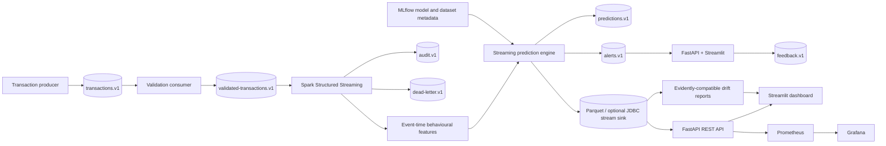

# SentinelStream architecture

SentinelStream is a local-first fraud-risk platform. The serving path keeps
transaction contracts, feature definitions, scoring, persistence, and operator
interfaces separate so offline evaluation and online processing can share
behaviour definitions.

## Event flow

Kafka topics are versioned and created by `KafkaTopicManager` and the Compose
`kafka-init` service. Transaction, validated-transaction, prediction, and
alert topics use `customer_id` as their partition key to preserve per-customer
ordering. Feedback uses `transaction_id`; audit and dead-letter records use a
stable event/message key. The catalog is defined in
`src/sentinelstream/streaming/topics.py`.

| Topic | Purpose |
| --- | --- |
| `sentinelstream.transactions.v1` | Serving-safe ingress events |
| `sentinelstream.validated-transactions.v1` | Schema-valid events for scoring |
| `sentinelstream.predictions.v1` | Model and feature outputs |
| `sentinelstream.alerts.v1` | Review/block interventions |
| `sentinelstream.feedback.v1` | Analyst outcomes |
| `sentinelstream.audit.v1` | Append-only lifecycle evidence |
| `sentinelstream.dead-letter.v1` | Poison messages and failed handlers |

## Processing and storage

The Phase 6 online pipeline handles validation, retries, manual offsets,
replay, and dead-letter routing. The Compose topology runs a small validation
worker between the ingress and validated topics. Spark consumes validated
records with event-time watermarks, deduplication, and checkpointed state. Its
streaming prediction engine combines the model, anomaly, and rules signals
available to the streaming job; the API hybrid engine additionally accepts
customer, merchant, and device profiles. PostgreSQL repositories persist API
operational records; Parquet and an optional JDBC stream sink persist Spark
batch output; Redis provides bounded-TTL risk and recent-result caching.

Kafka/Spark output is not currently projected into the ORM transaction,
prediction, and alert tables. That is an explicit integration boundary: the
direct FastAPI prediction path populates those tables, while the streaming path
is observable through Kafka and its configured Spark sink. A transactional
projection service and idempotent sink policy are follow-up work for a stronger
production topology.

FastAPI is the authenticated service boundary. Streamlit calls the API rather
than reimplementing model or persistence logic. MLflow tracks model and
research lineage. Prometheus and Grafana expose operational signals, while the
drift monitor stores JSON and human-readable HTML reports.

## Trust boundaries and deployment

External events enter through Kafka and are validated before feature state is
updated. Analysts enter through the JWT/RBAC API boundary. Credentials and
service URLs are environment-configured. Logs redact secrets and pseudonymise
common identifiers; raw model input is not changed by presentation masking.
The residual production risks are documented in [`SECURITY.md`](../SECURITY.md).

`docker-compose.yml` provides the local demonstration topology: Kafka, Kafka
UI, PostgreSQL, Redis, MLflow, Spark master/worker/streaming job, FastAPI,
Streamlit, Prometheus, and Grafana. This is not a production HA deployment;
production needs managed brokers/databases, secret rotation, network policy,
artifact signing, and an external identity provider.
