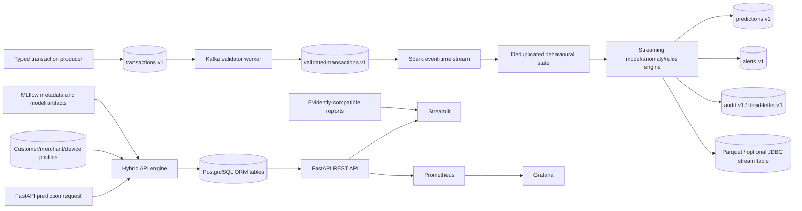

# SentinelStream final engineering and research audit

**Audit date:** 2026-07-26  
**Repository:** SentinelStream  
**Audit status:** Complete with documented limitations  
**Assessment:** Strong local-first portfolio and research system; not evidence of a production banking deployment.

## 1. Scope and evidence standard

This audit covered the repository source tree, tests, configuration, Kafka and
Spark contracts, persistence, API, dashboard, MLOps, monitoring, security,
research scripts, Docker/Compose files, GitHub Actions workflows, migrations,
documentation, and generated-artifact hygiene.

Claims in this document are based on one of three evidence levels:

1. **Executed locally:** the command or test was run in this workspace and its
   result is reported below.
2. **Static validation:** source/configuration was inspected or validated
   without starting the external service.
3. **Not validated:** the required service or tool was unavailable. No health,
   performance, security, or integration result is inferred from configuration
   alone.

The audit does not treat the existence of a Compose service, dashboard panel,
metric, model registry helper, or documentation claim as proof that its
external runtime integration works.

## 2. Executive conclusion

SentinelStream has a coherent architecture spanning typed transaction
contracts, Kafka reliability primitives, Spark event-time processing, offline
features, fraud decisioning, explainability, SQLAlchemy/Alembic persistence,
Redis caching, FastAPI, Streamlit, MLflow, Prometheus, Grafana, drift reports,
research tooling, tests, and local deployment configuration.

The implementation is credible as a local-first engineering and research
demonstration. The local quality gate passes 109 tests, Ruff, mypy, the
documentation/configuration validator, and the lockfile check. The tested Spark
path runs with the pinned PySpark 4.2.0 dependency. A rules-only research smoke
run logged to a local SQLite MLflow backend, and an offline synthetic demo ran
successfully.

The repository should not be described as production-ready. The most important
remaining architectural limitation is that Kafka/Spark prediction and alert
outputs are not projected into the Phase 9 ORM transaction, prediction, and
alert tables. Spark can write Parquet and an optional JDBC stream table, while
the FastAPI operational views are populated by the direct prediction service.
The second important limitation is that the Spark JDBC/Parquet path is
at-least-once and does not itself provide a cross-retry transactional sink.

Docker, Kafka, PostgreSQL, Redis, Prometheus, Grafana, MLflow server, and the
complete Compose demonstration were not started in this environment because
the `docker` executable is unavailable. Those integrations remain unvalidated.

## 3. Findings and disposition

| Priority | Finding | Disposition |
| --- | --- | --- |
| High | Kafka/Spark results do not flow into ORM operational tables used by the API/dashboard. | Documented as an explicit boundary. Add a transactional projection consumer before claiming a complete operational stream-to-dashboard path. |
| High | Spark JDBC and Parquet writes are append-style at-least-once sinks. A retry can duplicate a micro-batch unless downstream deduplication is applied. | Documented. Add a batch ledger/upsert or another idempotent sink strategy. |
| High | No real labelled fraud dataset, trained serving bundle, or live model-serving deployment was validated in this audit. | Synthetic and rules-only runs are labelled as smoke checks; no model-quality conclusion is made. |
| Medium | The initial Alembic revision calls `Base.metadata.create_all()` rather than expressing incremental DDL operations. | Acceptable for the initial local schema, but future schema changes need explicit Alembic revisions and migration tests. |
| Medium | Local authentication uses configurable HS256 secrets and a local authenticator. Key rotation, external identity, refresh-token revocation, and multi-instance identity management remain deployment work. | Documented in `SECURITY.md` and README. |
| Medium | Compose is a single-node development topology with development fallbacks and no HA, backup, image-signing, or network-policy evidence. | Correctly described as local development only. |
| Medium | The repository currently has no tracked Git files (`git ls-files` reports 0); the visible tree is untracked. | Before publication, commit the intended source and documentation baseline and verify ignored generated/backup files are absent from the published repository. |
| Low | Advanced research additions are incomplete: graph features, fairness analysis, counterfactual explanations, rolling backtests, shadow champion/challenger traffic, and a chaos harness are not implemented. | Not fabricated. See Section 12. |

No local test exposed a confirmed critical authentication bypass, unsafe SQL
construction, nondeterministic dead-letter identity, Spark merchant-velocity
calculation error, or false trained-model probability in the no-model fallback.
Those statements are bounded by the tests and environment described here.

## 4. Corrective work completed during the audit

The following genuine correctness, security, integration, and documentation
issues were fixed while auditing the repository:

- Added the Compose `kafka-validator` worker and
  `scripts/run_kafka_validator.py` to connect the raw transaction topic to the
  validated transaction topic while preserving message identity and emitting a
  validation audit event.
- Added `scripts/publish_sample_transactions.py` and documented a bounded,
  deterministic serving-safe producer for the final demonstration.
- Aligned the Spark dependency, connector, Docker image, and documentation on
  PySpark/Spark 4.2.0 after testing the local Spark runtime. Added the optional
  PostgreSQL JDBC Maven package to Spark runtime configuration.
- Made readiness return HTTP 503 when a required dependency is unavailable.
- Rejected known development secret placeholders when the configured runtime is
  production; Compose now defaults explicitly to development mode.
- Made Spark poison-message IDs deterministic from topic, partition, and
  offset, and fixed merchant velocity to use the most recent merchant event.
- Added an explicit nullable `model_probability` field. The Spark no-bundle
  path no longer presents a rule score as if it were a trained-model
  probability.
- Added the `sensitive:read` permission, masked identifiers for restricted API
  roles, expanded PII keys, and redacted exception text in structured logs.
- Corrected Dockerfile references in Docker and release workflows and extended
  the documentation validator to check Dockerfile paths in Compose and Actions.
- Updated README, architecture, Spark, demo, security, and progress
  documentation to distinguish tested behaviour from deployment assumptions.

Primary files involved include `src/sentinelstream/api/app.py`,
`src/sentinelstream/api/security.py`, `src/sentinelstream/config/settings.py`,
`src/sentinelstream/security/pii.py`, `src/sentinelstream/streaming/validator.py`,
`src/sentinelstream/spark/{ingestion,prediction,runtime,state}.py`,
`docker-compose.yml`, `docker/fastapi.Dockerfile`, `docker/spark.Dockerfile`,
the relevant workflows, `scripts/validate_docs.py`,
`scripts/publish_sample_transactions.py`, and their focused tests.

## 5. Architecture and end-to-end flow

The validated architecture is:



The Kafka topic catalog is defined in
`src/sentinelstream/streaming/topics.py` and contains:

| Topic | Contract/purpose | Partition key |
| --- | --- | --- |
| `sentinelstream.transactions.v1` | `TransactionMessage` ingress | `customer_id` |
| `sentinelstream.validated-transactions.v1` | `ValidatedTransactionMessage` | `customer_id` |
| `sentinelstream.predictions.v1` | `PredictionMessage` | `customer_id` |
| `sentinelstream.alerts.v1` | `AlertMessage` | `customer_id` |
| `sentinelstream.feedback.v1` | `FeedbackMessage` | `transaction_id` |
| `sentinelstream.audit.v1` | `AuditMessage` lifecycle evidence | `event_id` or message ID |
| `sentinelstream.dead-letter.v1` | `DeadLetterMessage` poison/failure record | original key or message ID |

Raw ingress is now connected to validated ingress in the Compose topology.
Spark consumes validated records using event timestamps, watermarks,
deduplication, state cleanup, checkpoints, and bounded behavioural state. Its
scoring path uses the model bundle when `model_path` is configured and otherwise
reports a null `model_probability` with the available rule/anomaly fallback.
The API hybrid engine supports the additional profile signals. These are two
related but not identical serving paths; the audit does not collapse them into
one falsely unified claim.

## 6. Data, schema, feature, and fraud-engine audit

### Contracts and schema handling

Pydantic contracts are shared at Kafka boundaries. Invalid records are rejected
or routed through retry/dead-letter handling, and the Spark ingestion path
creates deterministic dead-letter IDs for the same Kafka source record. The
offline and streaming feature modules expose corresponding definitions for
temporal and behavioural features. No Schema Registry is used; that is a
deliberate Pydantic-contract design choice, not an omitted service.

### Features and leakage

The feature registry covers raw transaction attributes, temporal features,
customer/merchant/device behavioural aggregates, novelty and velocity signals,
and anomaly-related inputs. The code uses event-time state in Spark and a
shared offline feature path where applicable. The key residual risk is not a
confirmed leakage bug but validation scope: feature leakage and temporal
consistency should be rechecked against a real labelled time-split dataset and
an actual serving model bundle before model claims are made.

### Decisioning and hybrid scoring

The decision layer has configurable weighted fusion, thresholds, risk tiers,
rules, confidence, calibration hooks, and fraud-cost logic. Ablation and
promotion helpers are present. The API path can combine supervised, anomaly,
rules, and profile signals. No measured comparison is asserted here because
the audit did not run a real labelled production-like dataset.

The no-model Spark fallback was corrected so a normalized rule score is not
serialized as `model_probability`. A trained model must be explicitly supplied
and compatibility-checked. The repository does not automatically create and
load a serving bundle merely because a training script has run.

## 7. Streaming and recovery audit

Implemented and locally tested:

- idempotent Kafka producer configuration, stable partition keys, retries,
  manual offset handling, replay support, poison-message routing, and
  in-memory producer/consumer integration;
- event-time parsing, watermark configuration, deduplication, late and
  out-of-order event tests, stateful customer/merchant/device features, and
  checkpoint-compatible Spark query construction;
- deterministic dead-letter identities and recovery/failure-path tests;
- Spark 4.2.0 local integration tests, including merchant velocity and the
  no-model prediction contract.

Not demonstrated live:

- broker delivery, actual consumer lag, replay from a running Kafka cluster,
  topic provisioning, connector download, or the Spark-to-Kafka/PostgreSQL
  deployment path;
- restart recovery against a real durable checkpoint and live external sink;
- exactly-once semantics across Kafka, Spark, and PostgreSQL.

The Spark JDBC writer appends to `sentinelstream_stream_events`; it does not
write the ORM tables and has no transaction ledger for cross-retry idempotency.

## 8. API, persistence, dashboard, and monitoring audit

FastAPI exposes prediction, explanation, alert, feedback, history, search,
health, readiness, liveness, and metrics routes with request schemas,
authentication, RBAC, bounded pagination, and restricted identifier display.
The readiness route now returns HTTP 503 for failed required dependencies.
FastAPI TestClient tests cover API, security, validation, and recovery paths.

SQLAlchemy models and repositories cover transaction, prediction, alert,
feedback, profiles, and audit records. Redis caching has TTL and fallback
behaviour. The initial Alembic revision is schema-bootstrap oriented rather
than a hand-authored incremental migration. Live PostgreSQL/Redis connection
pool, recovery, and performance behaviour were not externally started in this
environment.

Streamlit uses an API client and transformation/component helpers rather than
duplicating core fraud logic. Its empty/error/loading paths are unit-tested;
the browser UI itself was not started. No screenshot files are claimed.

Prometheus metric definitions, health checks, Grafana provisioning, and drift
report serialization are present and locally unit-tested. Prometheus scrape
targets, Grafana dashboard loading, and Evidently report serving were not
validated against live services.

## 9. Security audit

Observed controls include configurable JWT expiry/issuer/audience validation,
backend RBAC, sensitive-data permission checks, request bounds, environment
secret loading, placeholder rejection in production mode, identifier masking,
structured-log redaction, parameterized ORM queries, and non-root custom
containers. Raw tokens are not intentionally logged.

The principal residual security risks are local HS256 key management, lack of
external identity-provider integration and rotation evidence, process-local
fallback state when Redis is unavailable, development credentials in local
Compose defaults, and absence of live image/secret/static-analysis scans in
this environment. The project is not a security certification.

`SECURITY.md` contains the threat model, sensitive-data handling, reporting
guidance, and production recommendations. The current test suite covers invalid
and expired tokens, permissions, rate limiting, masking, redaction, malformed
requests, oversized payloads, pagination bounds, and secret validation.

## 10. Testing and quality evidence

### Executed successfully

| Command | Result |
| --- | --- |
| `make check` | 109 passed, 71 warnings in 32.84 seconds; Ruff and mypy steps passed |
| `uv run ruff format --check src tests scripts migrations` | 116 files already formatted |
| `uv run ruff check src tests scripts migrations` | Passed |
| `uv run mypy src/sentinelstream` | Passed; 93 source files |
| `uv run pytest --cov=sentinelstream --cov-report=term --cov-report=xml -q` | 109 passed; total measured coverage 75%; `coverage.xml` generated and ignored |
| `uv run python scripts/validate_docs.py` | Documentation, local links, workflows, and Compose YAML valid |
| `uv lock --check` | Passed; 176 packages resolved |
| `uv run pytest tests/integration/test_spark_streaming.py -q` | Passed earlier against the pinned local Spark runtime |
| `make security` | Bandit exit 0; pip-audit exit 0 with local unpublished package skipped |
| `uv run python -m py_compile scripts/run_kafka_validator.py scripts/publish_sample_transactions.py` | Passed |

The 71 warnings are mainly third-party deprecations and expected research
warnings for small/single-class smoke datasets. They should be reduced before
turning warnings into CI failures.

### Not executed or not available

The following were not claimed as passed: live Kafka/PostgreSQL/Redis/Spark
cluster tests, full Compose startup, browser/dashboard validation, Prometheus
scrape validation, Grafana provisioning load, live MLflow server validation,
container builds, container image scanning, Gitleaks, Trivy, Semgrep,
Hadolint, and Actionlint. The local tool check reported `docker`, `gitleaks`,
`trivy`, `semgrep`, `hadolint`, and `actionlint` unavailable; `docker compose
config --quiet` therefore failed with `command not found: docker`.

## 11. MLOps, research, and benchmark evidence

### MLOps smoke validation

The unit suite validates MLflow tracking/registry helpers, promotion criteria,
compatibility, dataset metadata, tuning helpers, and failure handling. A real
local MLflow SQLite smoke run was executed against 40 generated rows using the
rules model and five bootstrap resamples:

```text
experiment=mlflow-smoke-sqlite rows=40 models=rules skipped=none
output=/tmp/sentinelstream-research-audit/mlflow-smoke-sqlite
```

This proves the local code path ran. It is not evidence that a fraud model is
accurate, calibrated, promoted, or suitable for production.

### Offline demo

The deterministic offline demo was executed with 40 generated transactions:

```text
generated=40 valid=40 quarantined=0 duplicates=0
```

The data is synthetic. No financial-loss estimate, fraud-rate conclusion, or
model-quality conclusion is drawn from it.

### Benchmark

A bounded inference smoke benchmark was executed with five measured samples
and one warm-up on the local macOS Apple Silicon environment (Python 3.14.4).
Observed values were approximately: mean 24.34 microseconds, median 20.75
microseconds, p95/p99 36.37 microseconds, and 40,705 calls/second for the
isolated local inference function. This excludes network, serialization,
Kafka, Spark, database, model-loading, and explanation costs. It must not be
used as a service SLO or production throughput claim.

No Kafka, Spark-cluster, database, Redis, API-concurrency, or end-to-end
benchmark was executed.

## 12. Advanced research additions assessment

| Addition | Status | Audit conclusion |
| --- | --- | --- |
| A. Graph/relationship features | Not implemented | No graph source or relationship ground truth is present; do not imply graph-based detection. |
| B. Rolling temporal backtesting | Partial | Time-aware splitting exists, but a full rolling-window evaluation harness was not completed or run. |
| C. Fairness/bias analysis | Not implemented | No protected attributes or representative labelled evaluation population is available. |
| D. Failure-injection/chaos testing | Partial | Local failure-recovery tests exist; there is no repeatable multi-service chaos harness. |
| E. Champion/challenger deployment | Partial | Registry promotion, comparison, and rollback helpers exist; no live shadow traffic or challenger routing was validated. |
| F. Counterfactual explanations | Not implemented | SHAP and reason codes exist; counterfactual generation is not present. |

These are honest scope boundaries, not missing claims to fill with placeholder
results.

## 13. Required follow-up before production-style claims

1. Add a consumer/projector that converts validated Spark prediction and alert
   events into the ORM transaction, prediction, alert, and audit tables, with a
   durable idempotency key and retry ledger.
2. Define and test the operational sink semantics: at-least-once with
   deduplication, or a deployment-specific transactional design. Exercise
   replay and restart against real Kafka/PostgreSQL services.
3. Train and register a real compatible serving bundle on a governed labelled
   dataset; run temporal, calibration, cost, segment, and error evaluations.
4. Run the Compose stack on a Docker-capable host and record service health,
   migrations, topic creation, model loading, dashboard behaviour, Prometheus
   targets, Grafana provisioning, and the actual demo flow.
5. Replace local authentication defaults with an external identity provider or
   managed key lifecycle; validate rotation, revocation, audit retention, and
   multi-instance rate limiting.
6. Replace the schema-bootstrap migration approach with explicit incremental
   revisions for future changes and test upgrade/downgrade paths against a
   real PostgreSQL instance.
7. Add the unavailable security tooling to CI or an approved security runner,
   then review findings rather than treating tool success as a security
   guarantee.
8. Establish a tracked Git baseline, review ignored files, and remove local
   generated artifacts and backup files from the publication set.

## 14. Portfolio-readiness statement

SentinelStream is suitable for a portfolio demonstration of architecture,
typed event contracts, fraud decisioning, explainability, streaming concepts,
MLOps, monitoring, security controls, testing, and reproducible research
scaffolding. It is not yet suitable for a claim of a fully live, end-to-end
production fraud platform because the stream-to-ORM projection, durable
external-service validation, real-data model evaluation, and production
operations evidence are still outstanding.

No screenshots, live service health values, vulnerability-free conclusion,
production throughput number, model version, fraud-cost result, drift finding,
or statistical research conclusion is claimed by this audit.
